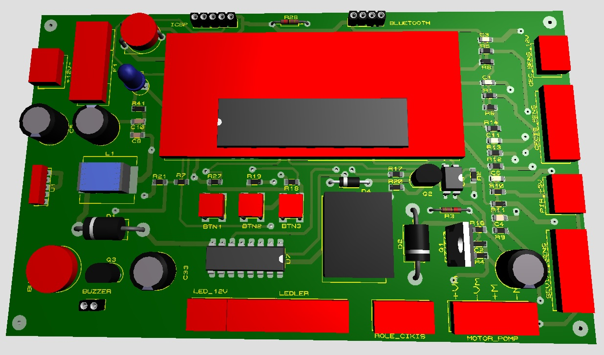

<h1 align="center">Oto Dezenfekte Sistemi / Clean Way</h1>

<p  align="center">
    
</p>

## İçerik

- [Giriş](#Giriş)
- [Çalışma Şekli](#Çalışma-Şekli)
- [Kullanılan Teknolojiler](#Kullanılan-Teknolojiler)
- [İletişim](#İletişim)

## Giriş

<p  align="center">
    
    <span> </span> 
</p>

 Covid-19 pandemi sürecinde geliştrilen ve her türlü işletmenin giriş veya çıkış noktasında Dezenfekte sıvısını uygun basınçta püskürterek dezenfekte işlemi gerçekleştirebilen bir sistemdir. Tamamıyla otomatiktir. 
 

## Çalışma Şekli

Mikrodenetleyici tabanlı gömülü sistem mimarisine uygun olarak tasarlamış bir elektronik devre tarafından kontrolü gerçekleştirilir.

<p  align="center">
    
</p>


Elektronik devre, kişinin algınlaması, püskürtme süresinin uygulanması ve dezenfektan sıvısının durumunu kontrol ederek sesli uyarılarla durumu bildirir. Ayrıca bütün bu işlemlere ait değişkenler bir karakter LCD üzerinden ayarlanbilir. LCD Türkçe, İngilizce ve Fransızca olmak üzere 3 farklı dilde ayar seçeneklerini gösterebilmektedir. 

<br>
<p  align="center">
    
</p>

Ayrıca isteğe bağlı olarak sistem üzerinde Temassız Ateş Ölçer cihazı da konulabilmektedir.

<br>
<p  align="center">
    
</p>


## Kullanılan Teknolojiler

```bash
- PIC18F45K22 mikrodenetleyici.
- CCS PIC C Derleyici
- Hareket algılama, sıvı seviye sensörleri.
- Pompa motoru yön ve basınç kontrolü.
- PCB devre şeması çizme ve oluşturma.

```

## Örnek çalışma videosu :

[](https://youtu.be/9W3VMVikV3s)

## İletişim

- GitHub [@your-ilyas9461](https://github.com/ilyas9461)
- Linkedin [@your-linkedin](https://www.linkedin.com/in/ilyas-yağcioğlu-6a6b17217)

### *** Not : 
Devre endüstriyel olarak üretimde olduğu için PCB devre şemaları paylaşılmamıştır.
